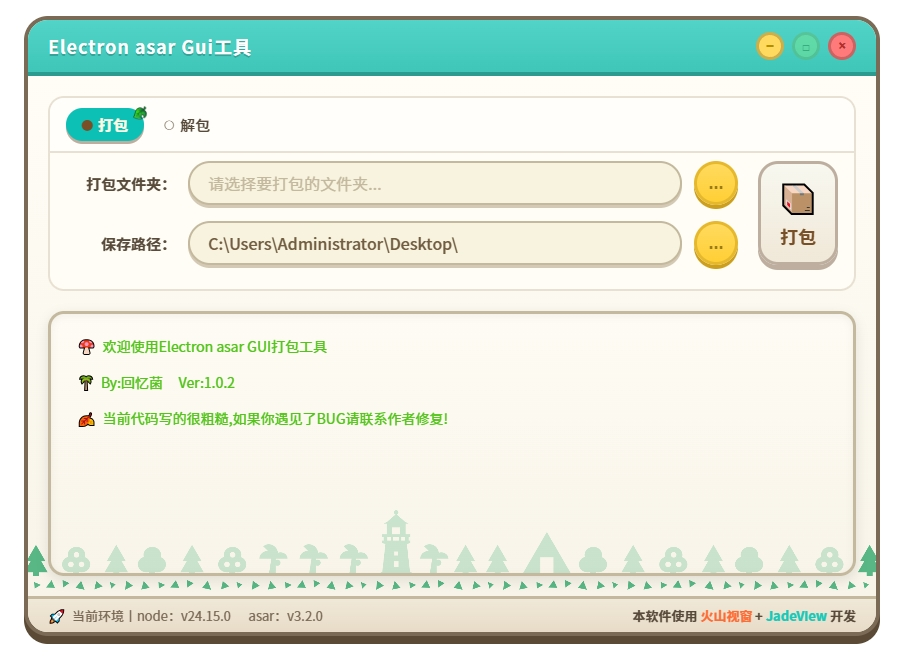

# Electron asar GUI工具

一款简洁易用的 Electron asar 文件打包/解包工具。

## 功能特点

- **打包功能**：将文件夹打包为 .asar 文件
- **解包功能**：将 .asar 文件解包为文件夹
- **图形界面**：简洁美观的 GUI 操作界面

## 界面预览

## 使用方法

### 打包 asar

1. 切换到「打包」选项卡
2. 选择要打包的文件夹
3. 选择保存路径
4. 点击「打包」按钮

### 解包 asar

1. 切换到「解包」选项卡
2. 选择要解包的 .asar 文件
3. 选择解包保存路径
4. 点击「解包」按钮

## 开发信息

- 开发框架：[火山视窗](https://www.voldp.com/) + [JadeView](https://jade.run/)
- 前端组件库：[Animal-Island-UI](https://github.com/guokaigdg/animal-island-ui)
- 许可证：MIT License
- 作者：回忆菌

---

> 本项目初衷是学习 JadeView 的使用，代码写得比较粗糙，还请大家多多包涵 ~ 🤝
>
> 本项目的前端代码完全由 AI 生成 ✨
